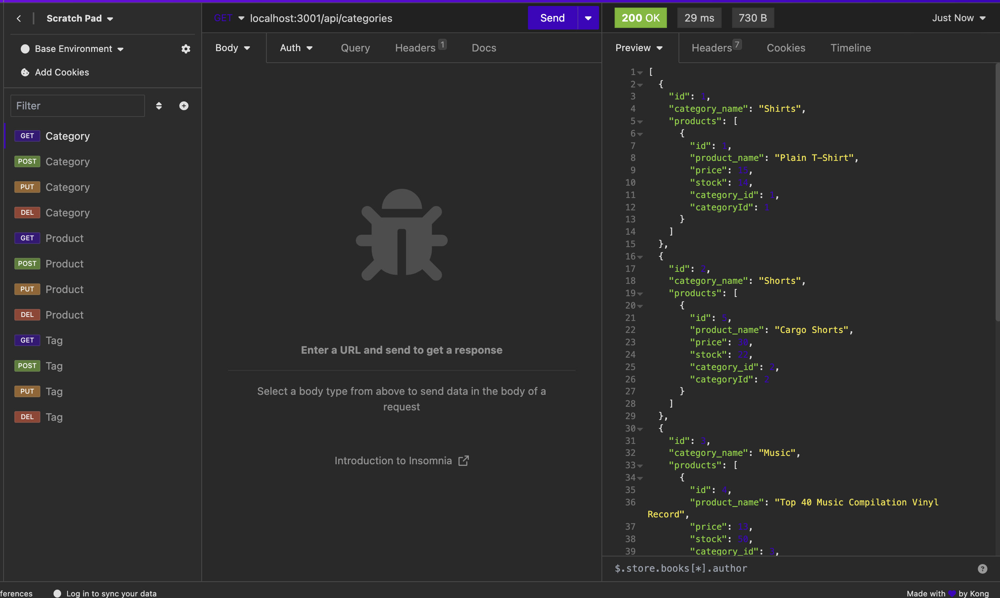

# E-commerce Back End Starter Code

## Description
The motive behind this project was to create back end for ecommerce website. It will save the user a ton of time organizing categories, products, and product tags for their ecommerce website. I learned how to implement CRUD through sequelize, and I also learned how to make GET/POST/PUT/DELETE requests using Insomnia. 
 
## Installation
1. Clone from repo.
2. Open folder with visual studio code or any text editor of choice.
3. Run 'npm run seed' to seed data
4. Run ‘node server‘ in terminal to run code.

## Usage
1. Open repo in terminal.
2. Run 'npm run seed' to seed data
3. Run ‘node server’ to start application
4. Open localhost port using Insomnia
5. Make GET/POST/PUT/DELETE requests

## Video Demo Link
[Click here for Demo Video](https://drive.google.com/file/d/1gsgyohQllQYYW417zOCZtpbUV1VqBP2t/view)